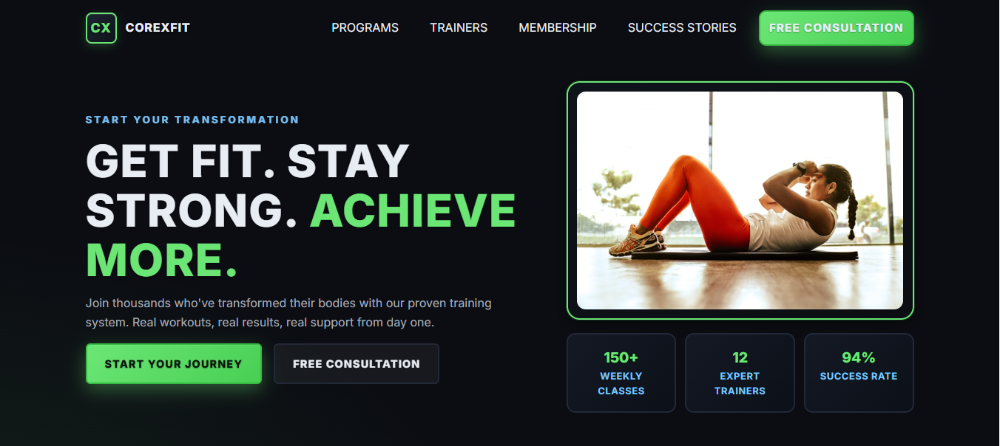

<div align="center">

# CoreXFit 💪

### Transform Your Fitness Journey

<p align="center">
  <strong>A cutting-edge fitness center landing page that combines modern web technologies with realistic fitness goals.</strong>
  <br>
  Built with responsive design principles and accessibility in mind, CoreXFit delivers an exceptional user experience across all devices.
</p>

<br>



<br>

## 🚀 [View Live Site](https://priyesh-04.github.io/CoreXFit/)

<br>

---

<h3 align="center">🔥 GET FIT. STAY STRONG. ACHIEVE MORE. 🔥</h3>

---

<br>

## ✨ Key Features

<div align="center">

| Feature | Description |
|---------|-------------|
| 🎯 **Modern Design** | Aggressive dark theme with CoreXFit branding |
| 📱 **Fully Responsive** | Mobile-first approach with CSS Grid & Flexbox |
| ⚡ **Performance** | Lightweight, fast-loading static site |
| 🎨 **Interactive** | Smooth animations and hover effects |
| 📧 **Contact Forms** | Professional contact section with validation |

</div>

<br>

## 🛠️ Tech Stack

<div align="center">


</div>

<br>

## 🚀 Quick Start

<div align="center">

```bash
# Clone the repository
git clone https://github.com/priyesh-04/CoreXFIt.git

# Navigate to project directory
cd CoreXFIt

# Open with live server or directly in browser
python -m http.server 8000
```

</div>

<br>

<br>

---

<div align="center">

*Built with ❤️ by [Priyesh Shukla](https://github.com/priyesh-04)*

</div>

</div>

